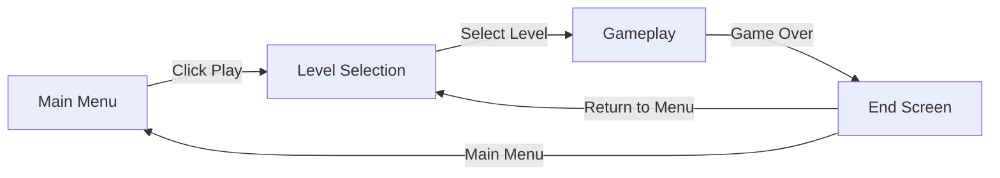

# 🎲 Dice Turret

> Roll the Dice, Defend Your Base!

[![Made with GameMaker Studio 2]

## 👥 Developer & Contributions

- **BSNnoob** - Programmer
- **Randamubox** - 2D Artist

## 📖 About

**Dice Turret** is a tower-defense inspired game where dice mechanics are used for attacking enemies. Players strategically roll dice to summon different types of turrets, each with unique abilities and attack patterns. Defend your base against waves of enemies by combining luck with tactical turret placement and upgrades.

## ✨ Key Features

### 🎲 Dice-Based Turret System
Roll dice to randomly generate turrets with different abilities. Each die face corresponds to a unique turret type with varying power levels and special attributes.

### 🏰 Tower Defense Mechanics
Strategic placement of turrets to defend against enemy waves. Use terrain advantages and turret synergies to create the perfect defense strategy.

### ⚡ Dynamic Enemy Waves
Face increasingly challenging enemy types with unique behaviors, resistances, and attack patterns that require adaptive strategies.

### 🎯 Multiple Turret Types
Unlock and utilize various turret classes including rapid-fire, splash damage, slow effects, and high-damage snipers based on your dice rolls.

## 🎮 Scene Flow



## 🛠️ Modules and Features

The dice-based tower defense mechanics including random turret generation, wave management, and strategic placement are powered by a comprehensive scripting system that creates an engaging gameplay experience.


## 📊 Game Flow Chart

```
1. Game Start
   └─ Player launches game → Main Menu loads → Settings can be accessed

2. Level Selection
   └─ Player clicks Play → Level Selection screen appears → Player chooses available level

3. Gameplay Initialization
   └─ Level loads → Starting resources allocated → First wave countdown begins

4. Dice Rolling
   └─ Player clicks Dice → Rolling animation plays → Random turret type generated

5. Turret Placement
   └─ Player selects placement location → Validation checks → Turret spawned or rejected

6. Wave Combat
   └─ Enemies spawn along path → Turrets auto-target and fire → Resources earned on kill

7. Wave Completion
   └─ All enemies defeated → Bonus resources awarded → Next wave countdown or victory

8. Defeat Condition
   └─ Base health reaches zero → Defeat screen displayed → Options: Retry or Level Selection

9. Victory Condition
   └─ All waves cleared → Victory screen displayed → Stars awarded → Progress saved

10. End Screen Actions
    └─ Player chooses: Retry level, Return to Level Selection, or Next Level (if unlocked)
```

## 🔄 Event Signal Diagram

### Core Game Events

**OnDiceRolled**
- Triggered when player rolls dice
- Sends turret type data to TurretManager
- Updates UI with result

**OnTurretPlaced**
- Triggered when turret placement confirmed
- Deducts resources
- Activates turret AI

**OnWaveStart**
- Triggered at wave beginning
- Spawns enemies via EnemyManager
- Updates wave UI counter

**OnEnemyKilled**
- Triggered when enemy health reaches zero
- Awards resources to player
- Updates kill counter statistics

**OnBaseHit**
- Triggered when enemy reaches base
- Reduces base health
- Checks for defeat condition

**OnWaveComplete**
- Triggered when all enemies in wave eliminated
- Awards bonus resources
- Initiates next wave or victory check

**OnGameOver**
- Triggered when base destroyed
- Stops all gameplay systems
- Transitions to defeat screen

**OnVictory**
- Triggered when all waves completed
- Calculates final score and stars
- Saves progress and unlocks next level

**OnPauseToggle**
- Triggered when player pauses game
- Freezes gameplay systems
- Displays pause menu UI

**OnResourceChanged**
- Triggered when resources earned/spent
- Updates ResourceManager
- Refreshes UI display

## 🎯 Installation

```bash
# Clone the repository
git clone https://github.com/yourusername/dice-turret.git

# Open the project in Unity
# Unity Version: 2022.3 LTS or higher recommended
```

## 🚀 How to Play

1. **Launch the game** from the Main Menu
2. **Select a level** from the Level Selection screen
3. **Roll the dice** to get a random turret type
4. **Place turrets** strategically on the battlefield
5. **Defend your base** against incoming enemy waves
6. **Earn resources** by defeating enemies
7. **Complete all waves** to achieve victory!

## 🎨 Assets & Credits

- **Programming**: BSNnoob
- **2D Art**: Randamubox


---

<p align="center">
  Made with ❤️ by the Dice Turret Team
</p>
